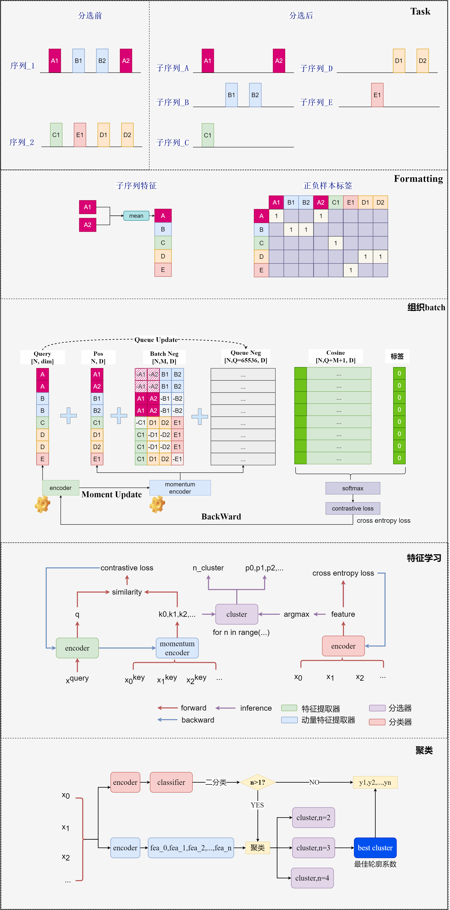

# 1 MMCV

基于mmcv框架快速开发深度学习项目；

## 1.1 mmcv深度学习框架结构图


## 1.2 Evaluation

Evaluation 是 Hook，区别于 CustomHook，由于其需要 val_dataloader 参数，因此，在 train api 中主动添加，而非配置文件的默认注册方式；

1. metric 设置待评估的指标，通过 eval_kwargs 传递给 dataset.evaluate；
2. greater_keys 和 less_keys 用于设置评估指标是越大越好，还是越小越好；
3. save_best，主评价指标，若 save_best 是 greater_keys 中指标，则将 save_best 指标最大的 checkpointer 序列化为 best_checkpointer；
4. EvaluationHook 通过调用 test_fn，即 single_gpu_test 函数遍历 val_dataloader 获取推理结果 result 并将 result 传入 dataset.evaluate 函数计算指定指标；
5. 默认 EvaluationHook 每次是在 train 或 val 工作流执行完一次 epoch 才触发；不能不执行 epoch 直接验证；

## 1.3 Runner

1. runner 工作流设置[(train,1)]即可，val 工作流与验证评估无关，已然调用的是模型的 forward_train，输出 loss，而非 pre；
2. val 流和 train 流区别在于，train 流会执行 backward，且执行的是 hook 的 train 相关钩子，而 val 不会 backward，执行的是 hook 的 val 相关钩子；
3. 目前没碰到需要使用 val 工作流的场景；val 工作流与模型性能评估无关；

## 1.4  DataLoader

1. sampler 是定义样本索引的迭代顺序；如 batch_size=n，就选前 n 个样本索引；sampler 非 None，shuffle 必须为 False，因为 sampler 相当于自定义 shuffle;
2. batch sampler 是直接定义每次 batch 用哪几个样本索引；batch sampler 非 None, sample/shuffle/drop_last 均采用默认值，因此 batch sampler 需要自定义 sampler/shuffle/drop_last 等操作，不需要 dataloader 去做；
3. collect_fn，mmcv 中将数据分为 data 和 data_metas，为了保证长度不一致不能将其打包为一个 tensor，它定义了一个 DataContainer 去包装 data_metas，而 data 仍然包装为 tensor; 由于 pipeline 只是对每个 dataset[i]做管道处理，不能处理多个样本的 format 操作，例如，按一个 batch 中样本最长值进行 padding，这些额外的 format 操作自定义 collect_fn，在 collect_fn 里进行处理；
4. dataloader 输出 tensor 都是 cpu 的，可以在 train 脚本调用前，给 model 添加一个 device 属性，另外在 model 的**call**方法中加入 input.to(model.device)，从而使数据和模型同一设备；call 方法在 forward 之前！

## 1.5 组件装饰器

1. 各个组件，mmcv 都是通过 regitster_module()方式装饰注册，为成功注册必须在**init**.py 中进行 import；
2. 构建组件实例是默认是通过 build_from_cfg 函数实现，对于通常组件不必写一个 build_xxx 函数，直接 build_from_cfg(cfg，NECK)这样就可以了；

# 2 项目应用

- 任务描述：将多个混叠序列进行解交织操作；
- 技术方案：
  - 特征训练网络：使同一序列点对应特征具有较高余弦相似度，BILSTM（backbone）+Transform（neck）+Moco（InfoNCE loss）；
  - 交织判读网络： 判断当前序列是否存在交织，BILSTM（backbone）+ Linear（head）+ sigmoid（BCE loss）;
  - 聚类：判断混叠的子序列数量，兰德系数在训练过程中做聚类模型的有监督评价，轮廓系数在推理过程中做聚类模型的无监督评价；



# 3 Citation

```
@misc{mmcv,
    title={{MMCV: OpenMMLab} Computer Vision Foundation},
    author={MMCV Contributors},
    howpublished = {\url{https://github.com/open-mmlab/mmcv}},
    year={2018}
}
```

